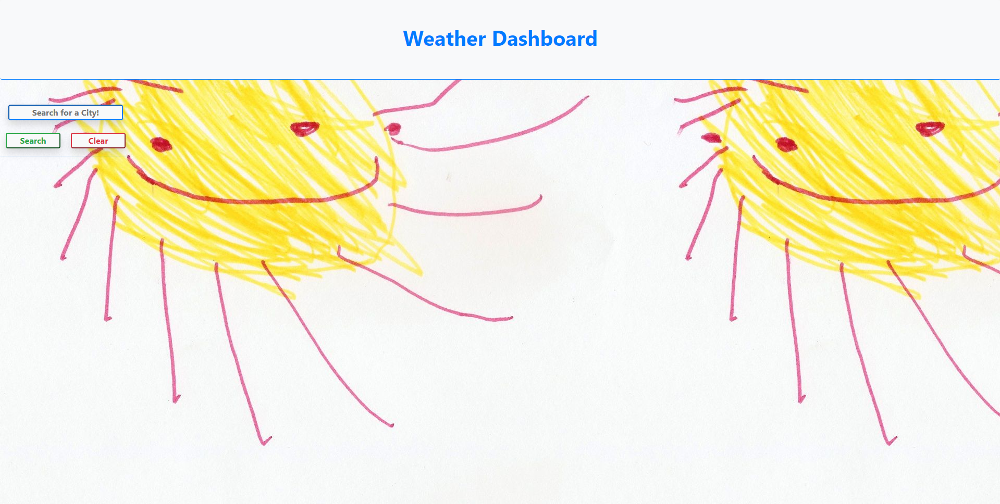

# MoeC-WeatherDashboard

Weather dashbaord requests user to input a city.
Upon input of a valid city, dashboard will display current weather and 5-day forecast.
Text for uv and temp will change colour depending on value.
Inputs are stored locally and displayed in search history with a clear button to clear everything.
Amazing background picture definitely not hand-drawn by an adult man to complete the app.

#Screenshots

Homepage on load

Homepage on search

Homepage with history :(

#Links
Github Repo: https://github.com/moeac/MoeC-WeatherDashboard.git  
Website Link: https://moeac.github.io/MoeC-WeatherDashboard/
